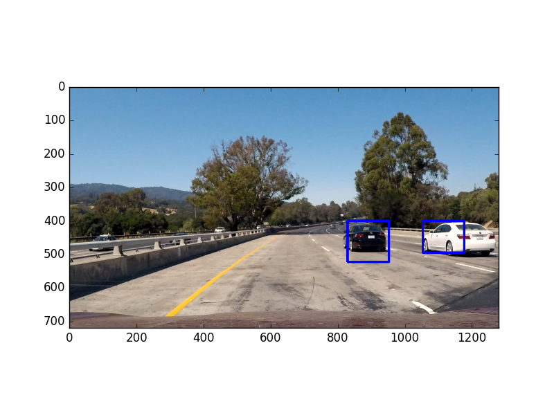
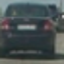
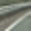
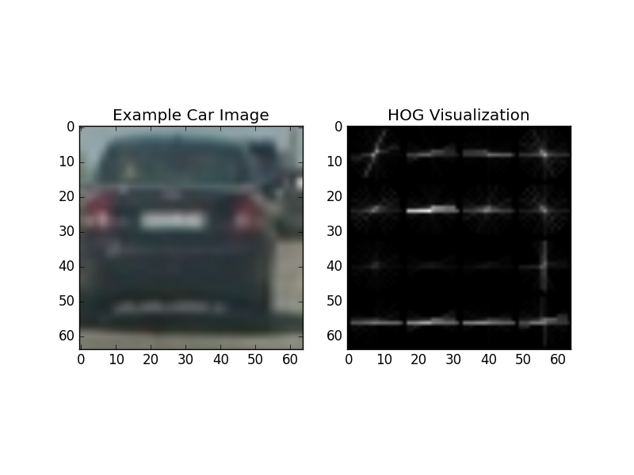
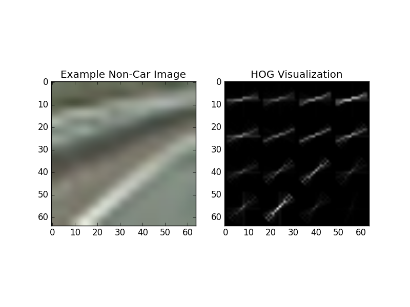
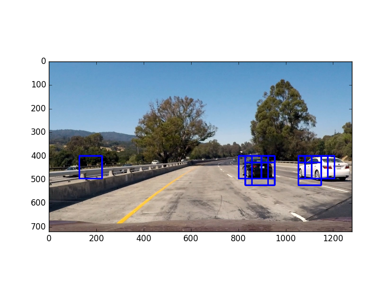
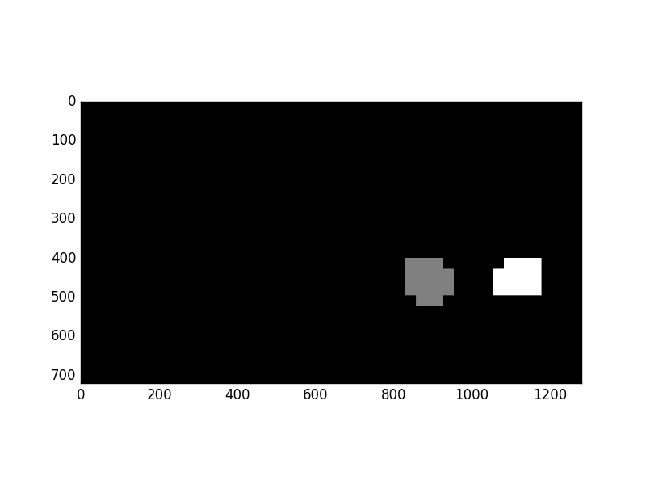

# Vehicle Detection

[Final video output](https://youtu.be/cipgjd5fhWg)

## Overview
Detect vehicles using HOG + SVM classifier with sliding windows. 

The overall pipeline is the following:

* Gather and organize the data
* Perform a Histogram of Oriented Gradients (HOG) feature extraction on a labeled training set of images
* Train a linear SVM classifier on normalized HOG features
* Implement a sliding-window technique and use trained classifier to search for vehicles in images
* Run the above steps on a video stream and create a heat map of recurring detections frame by frame to reject outliers and follow detected vehicles.
* Estimate a bounding box for vehicles detected.

## Pipeline details
### Gather and organize the data
I downloaded data for this project, in which Udacity provided [vehicle](https://s3.amazonaws.com/udacity-sdc/Vehicle_Tracking/vehicles.zip) and [non-vehicle](https://s3.amazonaws.com/udacity-sdc/Vehicle_Tracking/non-vehicles.zip) images of size 64x64 pixels. The vehicle and non-vehicle images were extracted from the [GTI](http://www.gti.ssr.upm.es/data/Vehicle_database.html) and [KITTI](http://www.cvlibs.net/datasets/kitti/) datasets.

Run `pickle_data.py` to create `data.p`. The pickle file contains numpy arrays representing the vehicle and non-vehicle images.

The following is an example of an image in the "vehicle" class:

The following is an example of an image in the "non-vehicle" class:

### Histogram of Oriented Gradients (HOG)
 `extract_features()` in the file `feature_extraction.py` used to extract feature from the frame. `HOG feature` are extracted by `get_hog_features` using `hog()` of `skimage`.
    

After many iteration and trails the HOG feature are as following:

* Color space: RGB
* Channel: (all)
* Orientations: 30
* Pixels per cell: 16
* Cells per block: 2

The above parameters are hard-coded in the file 'settings.py'.

Below is a visualization of the HOG feature extraction as follows.

Vehicle HOG:

Non-vehicle HOG:

There is clear understanding of difference between vehicle and non-vehicle frames.

### Train a linear SVM classifier
linear SVM classifier is used to train images which using HOG features respectively. The 

        
Note: ratio of non-vehicles and vehicles 3:1 by stacking car_features over the notcar_features. To avoid too many false positives.
 
 Normalize the feature by `StandardScaler`

Split the data to train and test data. Train the `SVM` on train dataset and saved as pickle file `model.p`.

### Sliding window search
A basic sliding window search techinque to detect a vehicle is likely present. A window size of 96x96 pixels worked well for the scale of vehicles present in the project video, 

The search for the car is limited buy RoI coordinates as below: `x_start_stop=(100, 1180), y_start_stop=(400, 500)`. This allows the vehicle detector to perform faster than searching through the entire image by avoiding the areas of sky and trees and also reduces potential false positives in areas like the `sky` and `trees`.

I chose an overlap  0.7 . I found this gave me reliable detections with multiple detected bounding boxes on vehicles, i.e. the density of detections around vehicles is high, relative to non-vehicle areas of the image. This allows me to create a high-confidence prediction of vehicles in my heat map (more details later) and reject potential false positives.

`slide_window()` returns a list of window to search.
`search_window()` of `windows` uses trained `SVM` and `HOG` to classify the object in teh window with label `vehicle` or `non vehicle`. 

Below is an example of running my sliding window search on an image (blue boxes indicate a vehicle detection in that window):

### Final bounding box prediction

The high dense `blue boxes` are used to generate the a single box arround the car by using heat map.

After a heat map is generated, we threshold the heatmap into a binary image, then use `label()` function to draw the final bounding boxes based on thresholded heat map. The heatmap threshold is specified by the variable `heatmap_thresh` in the file 'settings.py' 

The above illustrations is on a static image. However, in a video stream, we can take advantage of the temporal correlation between video frames. The number of false positives can be reduced by keeping track of cumulative heatmaps over past 30 frames in the video and threshold the cumulative heatmaps using `HotWindows`.

## Final video output
[Here](https://youtu.be/cipgjd5fhWg) is the final video output on Youtube. The same video is 'out.mp4' in this repo. The original video is 'project_video.mp4'.

## Discussion
The most challening segment of this project was tuning parameters to reduce the number of false positives in the video. Even though `HOG and SVM` classifier reported good results after training, it did not necessarily mean good results vehicle detection.

A different way to perform vehicle detection would be to use deep-learning-based methods, such as [SSD](https://arxiv.org/abs/1512.02325) or [YOLO](https://arxiv.org/abs/1506.02640), which can achieve real-time speeds of 30+ fps.
